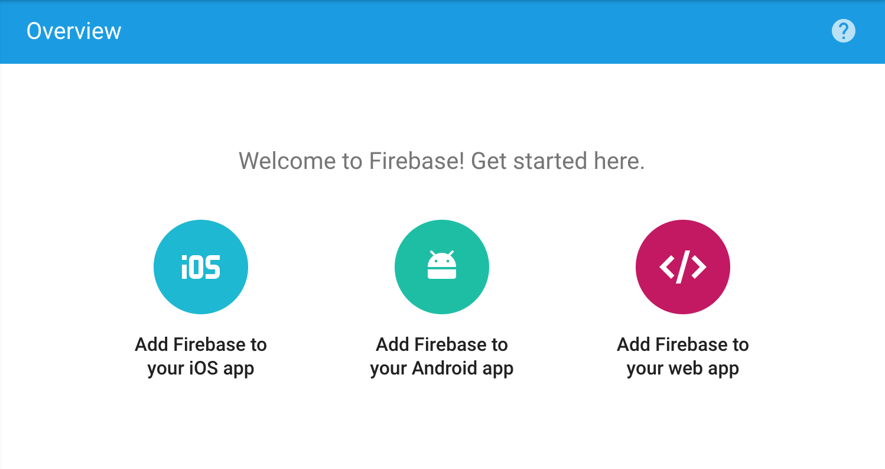

# Firechat 
> A sample app with Vue.js, Vuex and Google Firestore.

## Install
Install NPM :
``` Git bash
npm i -D
```

[Create an account Google Firestore.](https://firebase.google.com/)  
And obtain code (click “Add Firebase to your web app”) :


> You obtain that
``` JS
// Initialize Firebase
  var config = {
    apiKey: "...",
    authDomain: "PROJECT.firebaseapp.com",
    databaseURL: "https://PROJECT.firebaseio.com",
    projectId: "PROJECT",
    storageBucket: "",
    messagingSenderId: "..."
  };
  firebase.initializeApp(config);
```

Create config.js in ``./src/config.js`` and format same as :
``` JS
const config = {
    apiKey: "...",
    authDomain: "PROJECT.firebaseapp.com",
    databaseURL: "https://PROJECT.firebaseio.com",
    projectId: "PROJECT",
    storageBucket: "",
    messagingSenderId: "..."
};
export default config
```

Retur on Firestore and go to ``Left Menu``->``DEVELOP``->``Database``.  
Click “Cloud Firestore”, then select “test mode” (it means your database will be public, so don’t share the link on the internet anywhere).


Launch server
``` Git bash
npm run dev
```

## Doc
* Doc : https://vuejsdevelopers.com/2017/10/16/vue-js-firestore/  
* Doc to pdf : [./README/Build A Real - Time Chat App With VueJS, Vuex  Cloud Firestore.pdf](./README/Build_A_Real_Time_Chat_App_With_VueJS_Vuex_Cloud_Firestore.pdf)